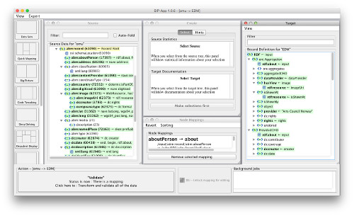

# SIP-Creator Integration

The [SIP-Creator](https://github.com/delving/sip-creator) is a metadata mapping tool which was originally built to solve the ingestion problem encountered at the [Europeana](http://www.europeana.eu/) project in 2010. It is a standalone Java tool which allows users to re-structure incoming data so that it corresponds with a desired format, specified in an XML file called a **Record Definition**.  It also validates the results using an associated **XSD** schema, as well as specific checking for valid URIs.  Beyond restructuring, the SIP-Creator uses the Groovy programming language to allow for various syntax normalizations while transforming.

For Narthex integration it was adapted and simplified, because its role has been reduced to its core functinality of building the mapping. (Previously, it was also responsible for harvesting and importing data, but this is now done by Narthex online).  It is now referred to as the SIP-App.

	Use of the SIP-Creator for this was considered the best solution for the time being, until the same processes can be realized using a fully browser-based schema matching, uri generation, and syntax normalization.  Ultimately, mapping should take place in the browser, and we have been working with the FORTH institute to develop a new standard for this, called [X3ML](https://github.com/delving/x3ml).
	
## Download and initial setup

The stand-alone application can be downloaded using a link that appears in Narthex on a dataset which is ready for mapping.  The link triggers a download from the build server where new versions are stored, so updating the application can be done quite easily.

The SIP-App logs in to Narthex in the same way that actors do in the web interface, with the same username and password.  Before it knows where to login, the URL of the accompanying Narthex installation is running.  This is a URL like this, ending in "/narthex":

	http://localhost:9000/narthex
	http://<some other domain>/narthex

When the SIP-App starts on a machine for the first time, it will ask for the URL and the login credentials.  The password is preserved so that login becomes automatic after the first time.  Pressing the refresh button on the datasets page can be used to adjust these, and the dialog will appear in the event that the login fails.

Also, every time the SIP-App starts it compares its version with the one currently available via the Narthex link, and warns the user if a new version is available.

## Download dataset sip-zip file

After successful login, a list of available sip-zip files appear in the leftmost panel of the datasets frame.  One of these can be selected for download, after which they appear in the middle panel where all downloaded datasets are unpacked and ready for building or adjusting their mappings.

All datset sip-zip files are named strictly according to a pattern which clearly indicates the date when they were built, so there is never confusion about which data belongs to which mapping session.  It also allows for exploring older mappings and comparing if they are not intentionally deleted.

## Build the mapping

The process of building a mapping is something beyond the scope of this documentation.  The gist of it is that the source tree appears to the left, and the target record definition to the right.  Selecting items from both allow mappings to be created, and then mappings can be adjusted by using snippets of Groovy (programming language) code.  The code is edited "live" in the sense that the code is immediately compiled and executed, so that the user can see the results immediately.

## Validate, correct

When the mapping has been built to satisfaction, and correct records appear in the "Big Picture" view, the transformation/validation can be executed.  This produces an output file containing all the transformed and validated records, and when that is complete, the user can pack up the successful version of the mapping in a sip-zip file for upload.

## Create SIP-Zip file and upload to Narthex

The rightmost panel of the datasets frame shows the SIP-Zip files which have been created by the SIP-App after validation.  Any SIP-Zip file can be selected and uploaded to Narthex at any time, although mostly only the top (most recent one) will be uploaded.

## Round trip

Once the SIP-Zip has been uploaded, Narthex uses its mapping to map and validate (process) the source data on the server side.  It also builds a new SIP-Zip, which is ready for download when the mapping is to be adjusted the next time.

---

Contact: info@delving.eu;