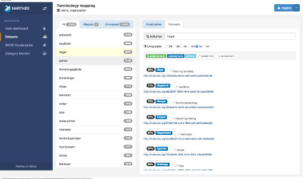

# Terminology Mapping

Most cultural heritage data managed in collection registration packages includes various fields containing terminology, but the terms used typically have a local origin, and are recorded in the local language.  Narthex then reveals these fields in the form of histograms with all values visible along with occurrence frequencies.

A terminology field should contain a modest number of different elements - in the order of tens, hundreds, or perhaps a few thousand, but **not** tens of thousands of values (if a field contains that many values, it is probably not really a terminology field).  Examples might be fields for "technique" or "material" or "genre".

When terminology fields are identified, they can be mapped to common vocabularies so that the data from various sources can be connected together and queried as a whole.  Vocabularies also often contain labels in multiple languages, which can enable multilingual search.

The exercise of term mapping puts the terms created in practice beside similar terms compiled into a separately-developed vocabulary can reveal much about the process that led to the usage of the terms in the source.  The results of the mapping in Narthex should eventually find their way back to the source to improve consistency.

Before source terms can be mapped to a SKOS vocabulary, they must be turned into a SKOS vocabulary, which we call "Skosification".

## Skosification

The process of skosification is done automatically when the choice is made to prepare an appropriate field for vocabulary mapping.  It is a two-step process.

Skosification first takes the values from the histogram and creates new entries in a SKOS vocabulary directly associated with the dataset.  This is, of course, a minimal SKOS vocabulary (no narrower/broader relationships etc) but it is augmented with the occurrence frequencies from the source histogram so that these can appear later and help to prioritize the mapping work.

The second part of the process is to actually modify the field entries in the triple-store representation of the data records.  Terms often appear many times, so this process goes through all occurrences and does a replacement:  the field must now **point** to the newly-created SKOS entry, rather than **contain** the literal value.  This pointer can later always be followed in order to once again reveal the original literal value.

With this indirection in place, the mapping process is something that takes place between one SKOS(-ified) vocabulary and another (imported) SKOS vocabulary.

## SKOS vocabularies

Before any mapping can be done, a target vocabulary must be introduced.  Vocabulary files containing SKOS/XML data can be simply dropped on Narthex, at which point they will be pushed into the triple store verbatim.

When there are multiple target vocabularies, they can be switched in the mapping interface. This way, fields which may contain a mix of different terminologies can each be mapped to the most appropriate target vocabulary.

SKOS vocabularies often contain labels in multiple languages, so Narthex provides a switching mechanism during mapping.  This way the searching and comparison are restricted to one language at a time and it becomes easier to find the right matching labels.

## Results

The resulting mappings are recorded in the triple store along with the data, and each one is attributed to the actor responsible for creating it.  It is the responsiblity of the software acquiring its data from the triple store to follow the "skosification" links as well as the mapping links.  Typically this will take place during an indexing or a display process.

## Future work

Currently the mappings are recorded as **skos:exactMatch** but we may want to extend the mapping system so that different kinds of relationships can be represented, such as **skos:broader** and **skos:narrower**.

---

Contact: info@delving.eu;